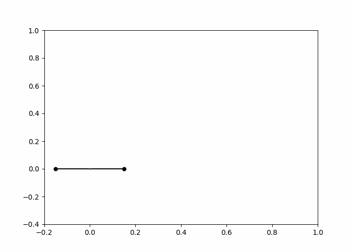
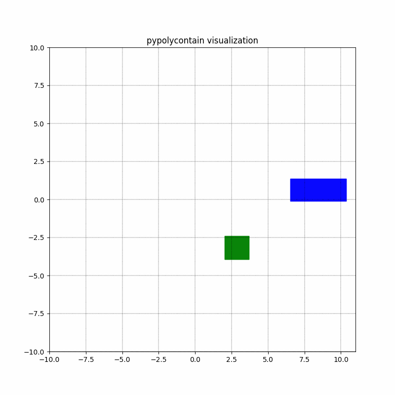
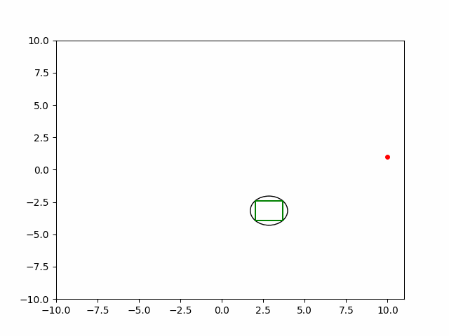
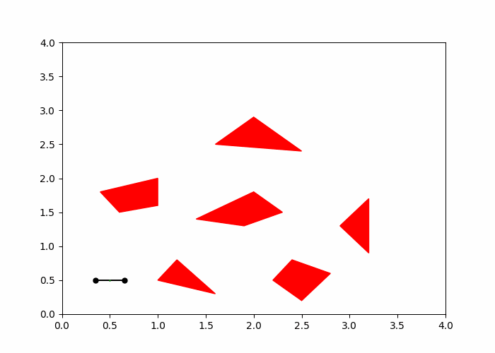
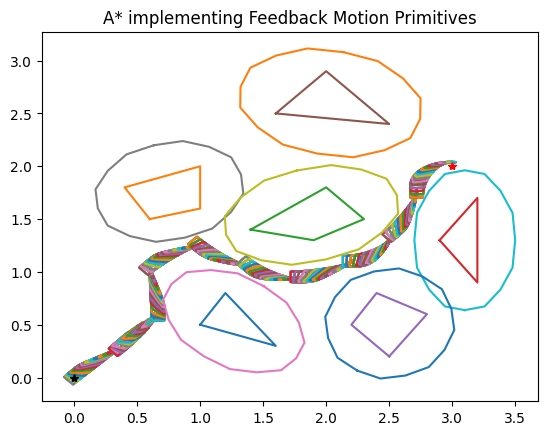
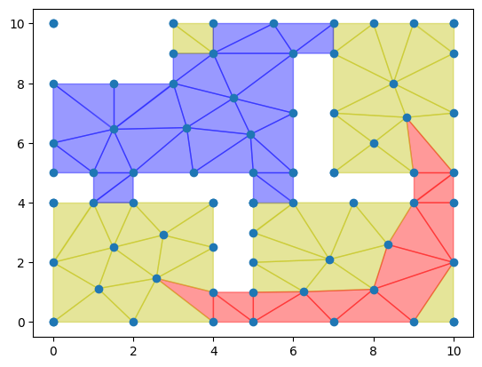
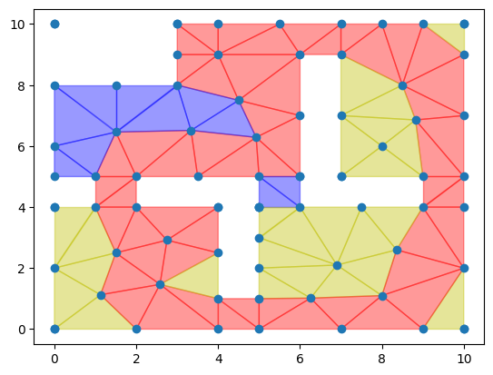

# **Safe Robot Control & Planning**  
KTH course DD2415 in safe robot planning & control; covers the fundamentals of robotic system safety, including safety analysis, reachability, and control techniques such as invariant sets, potential fields, and control barrier functions. It explores fail-safe and risk-aware planning, advanced motion planning algorithms, task and motion planning integration, and formal methods using temporal logics for correct-by-design control. Skeleton code src: https://github.com/KTH-RPL-Planiacs/DD2415_labs
## **0. Drone Dynamics**  
- **Continuous** and **discrete** time dynamics

  

 

## **1. Reachability & Control Barrier Functions (CBF)**  
- **Reachability** of uncertain linear systems using **zonotopes**  
- **Safe control synthesis** in a reactive setting using **control barrier functions**  

  
  

  

## **2. Motion Planning with Feedback Motion Primitives (FMP)**  
- **Optimization-based motion planning** for static & dynamic obstacles  
- **Motion planning** using **feedback motion primitives**  
- **Long-horizon planning** using feedback motion primitives (A*)  

  
  

  

## **3. Discrete Planning with Automata**  
- **Discrete planning** using **linear temporal logic**  
- **Büchi automata** & **product automaton**  
- **Weighted transition system** & product automaton with weights  
- **Nested depth-first search (NDFS)** for prefixes & suffixes  

  
  

   
